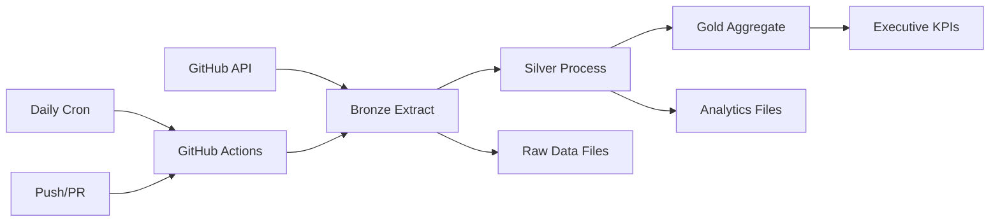

# CoOps Metrics - Medallion Architecture Pipeline

This project implements a comprehensive GitHub organization metrics collection and analysis system using a **Medallion Architecture** (Bronze → Silver → Gold) for data processing.

## 🏗️ Architecture Overview

### Data Layers

- **🥉 Bronze Layer**: Raw data extracted directly from GitHub API
- **🥈 Silver Layer**: Normalized and processed analytics-ready data  
- **🥇 Gold Layer**: Executive KPIs and aggregated metrics for dashboards

### Directory Structure

```
├── data/
│   ├── bronze/          # Raw GitHub API data
│   ├── silver/          # Processed analytics data
│   ├── gold/            # Executive KPIs and visualizations
│   ├── master_registry.json    # Complete file registry
│   └── data_catalog.json       # Data documentation
├── src/coops/           # Installable Python package (`uv sync`)
│   ├── bronze/          # Raw data extraction modules
│   ├── silver/          # Analytics processing modules
│   ├── gold/            # KPI aggregation modules
│   ├── utils/           # Shared utilities
│   └── etl/             # Orchestrators / console entry points
│       ├── bronze_extract.py     # coops-bronze
│       ├── silver_process.py     # coops-silver
│       ├── gold_process.py       # coops-gold
│       ├── gold_aggregate.py     # coops-aggregate
│       └── registry_manager.py   # coops-registry
├── pyproject.toml       # Package metadata, dependencies, entry points
└── .github/workflows/   # GitHub Actions pipelines
```

## 🚀 Quick Start

### Manual Execution

Install first: `uv sync` (or, without uv, `pip install -e .`).
The token and organization come from `GITHUB_TOKEN` / `GITHUB_ORG` (environment,
`.env` or `.secrets`), not from CLI flags.

1. **Extract Bronze Layer**:
   ```bash
   GITHUB_TOKEN=... GITHUB_ORG=coops-org uv run coops-bronze
   ```

2. **Process Silver Layer**:
   ```bash
   uv run coops-silver
   ```

3. **Process Gold Layer & aggregate KPIs**:
   ```bash
   uv run coops-gold
   uv run coops-aggregate
   ```

4. **Generate Registry**:
   ```bash
   uv run coops-registry
   ```

### GitHub Actions (Automated)

The pipeline automatically runs:
- **Daily at 5 AM UTC** (cron schedule)
- **On push to main branch**
- **On pull request to main branch**  
- **Manual trigger** via workflow dispatch

## 📊 Data Products

### Bronze Layer (Raw Data)
- `repositories_filtered.json` - Active organization repositories
- `members_detailed.json` - Organization member profiles
- `issues_<repo>.json`, `prs_<repo>.json`, `commits_<repo>.json`,
  `issue_events_<repo>.json` - one file per repository

The four `*_all.json` aggregates that used to sit beside these were removed in
#170. They repeated the per-repository files byte for byte — 159.8 MiB, 41% of
the Bronze tree — and `commits_all.json` had reached 80.6% of GitHub's 100 MiB
hard push limit, which in fork-and-forget mode stops the pipeline outright.
Read a family with `coops.bronze.files.bronze_records`, which enumerates the
per-repository files and excludes derived copies.

### Silver Layer (Analytics)
- `members_analytics.json` - Member maturity scores and classifications
- `contribution_metrics.json` - Comprehensive contribution statistics
- `collaboration_edges.json` - User collaboration network data
- `temporal_events.json` - Time-ordered activity timeline
- `activity_heatmap.json` - Hour/day activity patterns
- `cycle_times.json` - Issue/PR resolution time analysis

### Gold Layer (Executive KPIs)
- `executive_dashboard.json` - High-level organization metrics
- `performance_tiers.json` - Member performance categorization

## 🔄 Pipeline Workflow



### Sequenced Execution

1. **Bronze Extraction** (`bronze-extract.yaml`)
   - Validates organization
   - Extracts raw GitHub data
   - Commits bronze files
   - Triggers Silver processing

2. **Silver Processing** (`silver-process.yaml`)
   - Processes bronze data into analytics
   - Generates member, contribution, and collaboration metrics
   - Commits silver files
   - Triggers Gold aggregation

3. **Gold Aggregation** (`gold-aggregate.yaml`)
   - Creates executive dashboard KPIs
   - Generates performance tiers
   - Commits gold files
   - Completes pipeline

## 📋 Data Registry System

The system maintains comprehensive data lineage and cataloging:

- **Master Registry** (`data/master_registry.json`): Complete file inventory with metadata
- **Data Catalog** (`data/data_catalog.json`): Documentation and usage patterns
- **Layer Registries**: Individual layer file tracking

### Registry Features

- **File tracking**: All generated files with sizes and timestamps
- **Data lineage**: Input/output relationships between layers
- **Usage patterns**: Recommended file combinations for different use cases
- **Dependency mapping**: Required execution order for scripts

## 🛠️ Configuration

### Environment Variables

- `GITHUB_TOKEN`: GitHub Personal Access Token with org read permissions
- `GITHUB_ORG`: Target organization name. In the `bronze-extract.yaml` workflow this defaults to `github.repository_owner` (the org that owns the repo); a `GITHUB_ORG` secret (e.g. from `.secrets` when testing locally with `act --secret-file`) overrides it to target a different org
- `GEMINI_API_KEY`: Optional, enables AI-powered member analysis when set

### Customization

1. **Repository Filtering**: Edit `src/coops/utils/github_api.py` → `OrganizationConfig.repo_blacklist`
2. **Metrics**: Modify individual processor modules in `src/coops/silver/`
3. **KPIs**: Edit `src/coops/etl/gold_aggregate.py` for custom executive metrics

## 📈 Analytics Capabilities

### Member Analytics
- Maturity scoring based on account age, repos, followers
- New vs. established member classification
- Contribution pattern analysis

### Collaboration Networks  
- Cross-repository collaboration detection
- Network centrality and hub identification
- Team collaboration density metrics

### Temporal Analysis
- Activity heatmaps by hour/day
- Contribution trends over time
- Issue/PR cycle time analysis
- Burndown and throughput metrics

### Performance Metrics
- Top contributor identification
- Performance tier classification  
- Repository activity comparison
- Cross-cutting collaboration analysis

## 🔍 Data Quality & Monitoring

- **API Rate Limiting**: Automatic handling with backoff
- **Caching**: Local cache prevents redundant API calls
- **Error Handling**: Graceful failures with detailed logging
- **Data Validation**: Size and record count verification
- **Lineage Tracking**: Complete audit trail of data transformations

## 🎯 Use Cases

### Academic Research
- Software engineering collaboration patterns
- Developer community dynamics
- Open source contribution analysis
- Team productivity metrics

### Organization Management
- Member engagement tracking
- Project health monitoring
- Resource allocation insights
- Performance trend analysis

### Dashboard Applications
- Real-time metrics visualization
- Executive reporting
- Team performance dashboards
- Temporal trend analysis

## 🔄 Migration from Legacy System

The old single-script approach (`get-bronze-data.py`) has been replaced with this modular medallion architecture. Benefits include:

- **Separation of Concerns**: Dedicated scripts for each data layer
- **Incremental Processing**: Only reprocess changed data
- **Better Error Handling**: Isolated failures don't break entire pipeline  
- **Scalability**: Easy to add new metrics and data sources
- **Maintainability**: Modular design with clear dependencies

Legacy workflows are deprecated but will redirect to the new pipeline for compatibility.

## 🤝 Contributing

1. Fork the repository to your organization
2. Ensure your organization has sufficient GitHub API permissions
3. Test changes with manual script execution before PR
4. Follow the established data layer patterns for new metrics
5. Update documentation for new data products

## 📞 Support

For issues or questions:
- Check the data registry files for debugging information
- Review GitHub Actions logs for pipeline failures
- Consult the data catalog for usage patterns
- Examine individual layer outputs for data quality issues